# Virtual Machine Installation & Configuration Guide

## 1. Install and Configure Virtual Machines using Virtualbox

In this tutorial it is accepted that:
- You have already installed Ubuntu 18.04.4 LTS in your *local* computer.
- You have updated and upgraded all packages.
- You have a valid internet connection.

### 1.1. Install VirtualBox from Command Line:
```bash
sudo apt install virtualbox
```
### 1.2. Get 18.04.4 LTS Server Install Image:
You can download iso file from the link: [Official Ubuntu 18.04.4 LTS Live Server ISO](http://releases.ubuntu.com/bionic/ubuntu-18.04.4-live-server-amd64.iso)

***OR***

You can download iso file from command line:
```bash
cd ~/Downloads
wget http://releases.ubuntu.com/bionic/ubuntu-18.04.4-live-server-amd64.iso
```

## 1.3. Create First Slave Machine
- Firstly, start VirtualBox using command below:
```bash 
virtualbox &
```
- Click "New" button.
- Enter _Name_ as "slave-1", _Type_ as "Linux", _Version_ as "Ubuntu (64-bit)".


- Select the amount of memory (RAM). We select _2048 MB_ (2 GB), arbitrarily.  You can change it up to your needs.

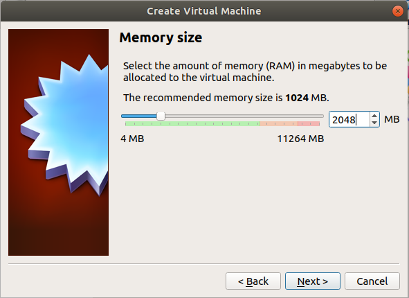

- Create a _virtual hard disk_ for convenience.

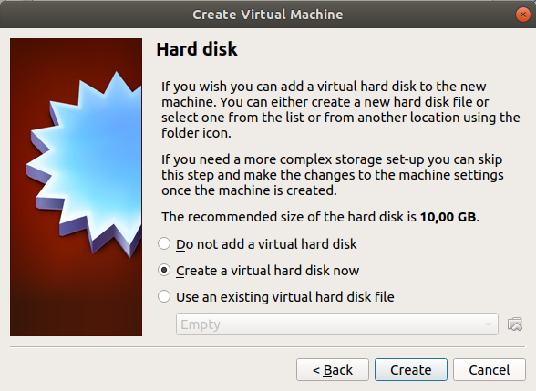

- Choose _VDI (VirtualBox Disk Image)_.

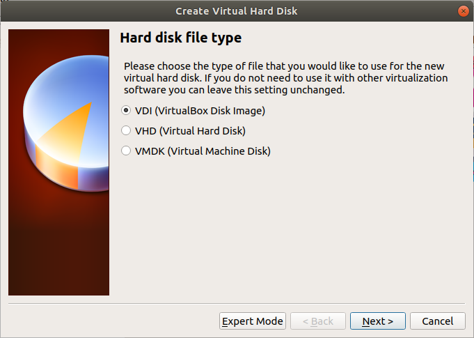

- _Dynamically allocated_ has its own advantages, so we will choose it. But _fixed-size_ option would also be selected if we were sure that disk size don't need to change in the future.

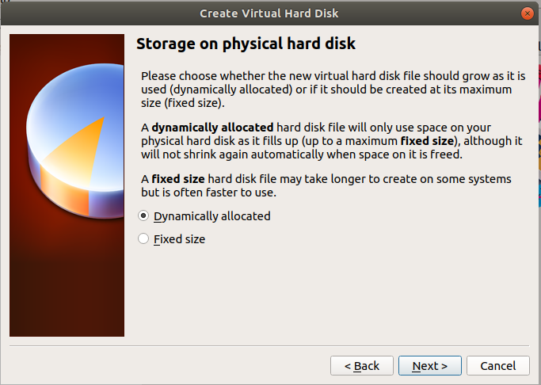

- We will enter the name of the new virtual hard disk file as "slave-1". This name is arbitrary, you can change it. Size of the virtual hard disk is **very important**. You should set it at least **20 GB**, we will set it as _50 GB_ to be safe.

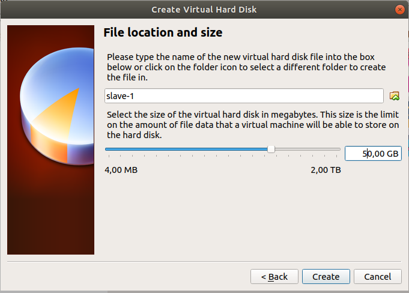

- Choose the Ubuntu ISO, you downloaded before.

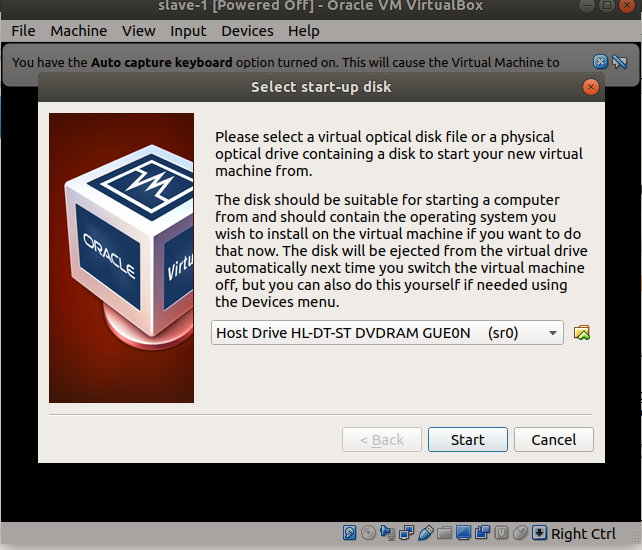
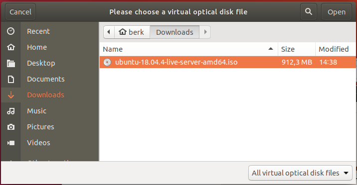
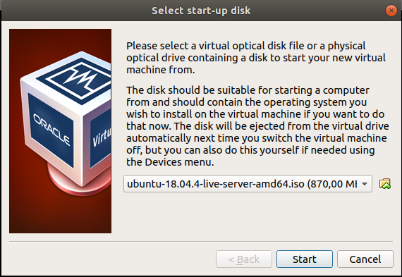

- Pass the initial parts and select the options. When you are in  _Profile setup_ part. We will set "Your Name" as _spark-user_, "Your server's name" as _slave-1_, "Pick a username" as _spark-user_. Names can change but user-names should be the same among all machines to be safe in future ssh connections.

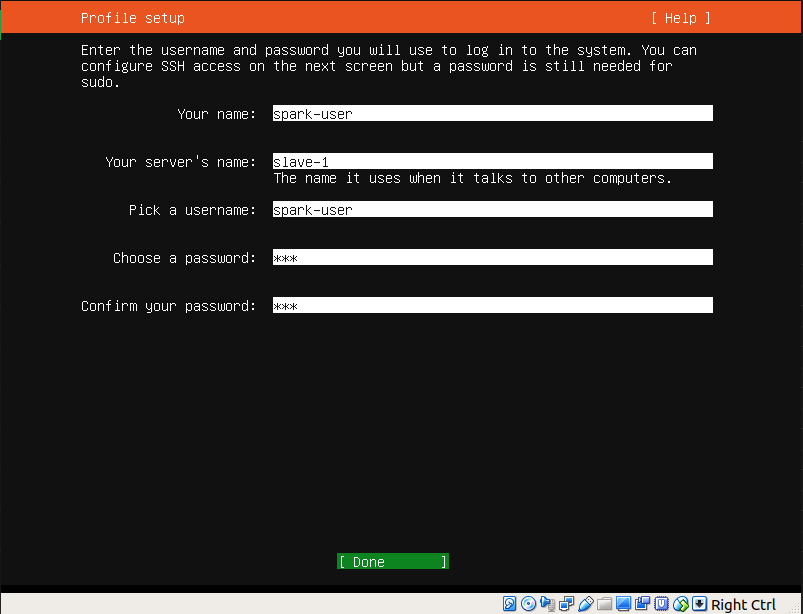

- Select "Install OpenSSH Server".

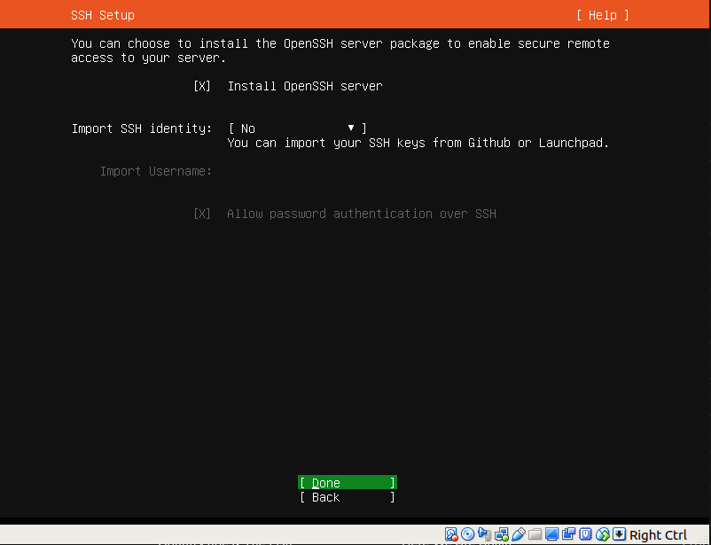

- No need to install any packages listed here. We can install them after the installation if needed.

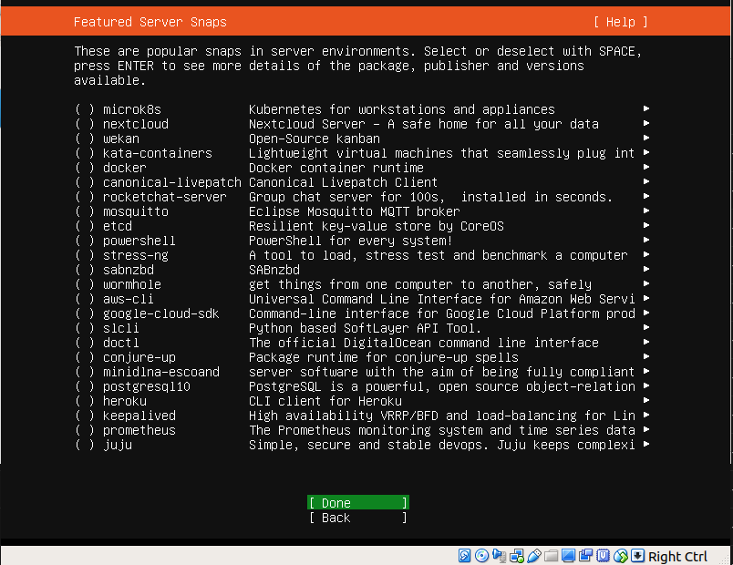

- Reboot after installation and you are done!

## 1.4. Create Second Slave Machine

You don't have to do all the things again. Simply, clone the first virtual machine.

- Shut machine "slave-1" down.
- Click right click on "slave-1" and select "clone" option. Rename the machine to "slave-2".

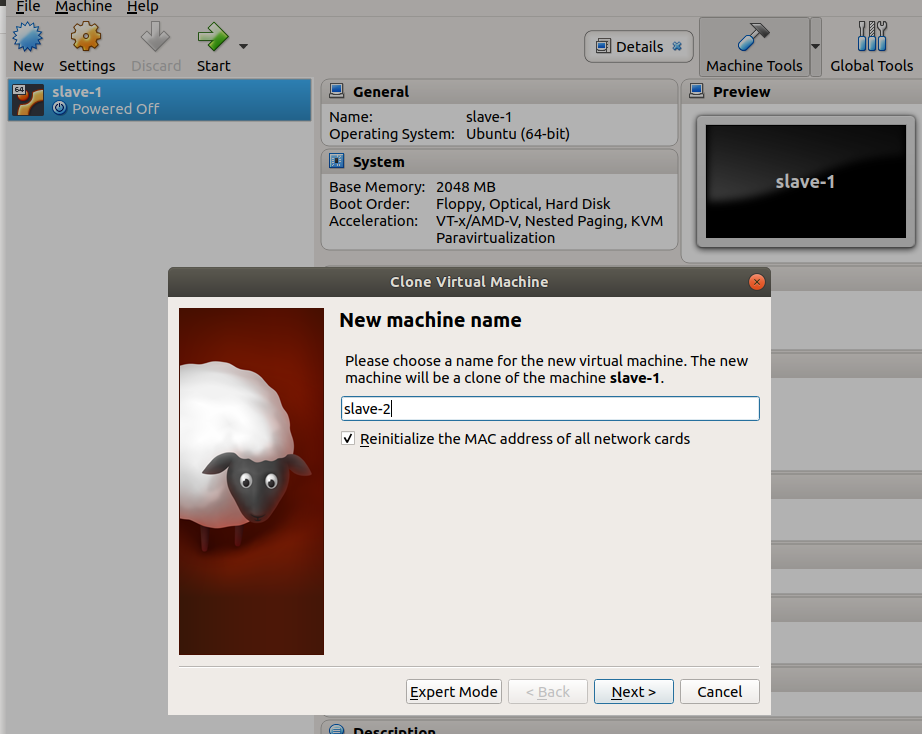

- Choose _full clone_ option and hit _Clone_.

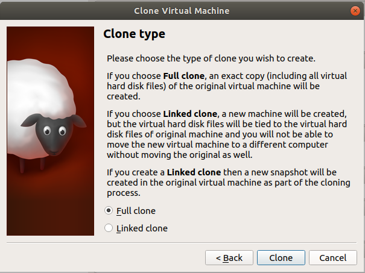

- Our second virtual machine is ready, but the hostname of the machine is still "slave-1". In order to fix this, start slave-2 and login with credentials you defined in the installation of slave-1.

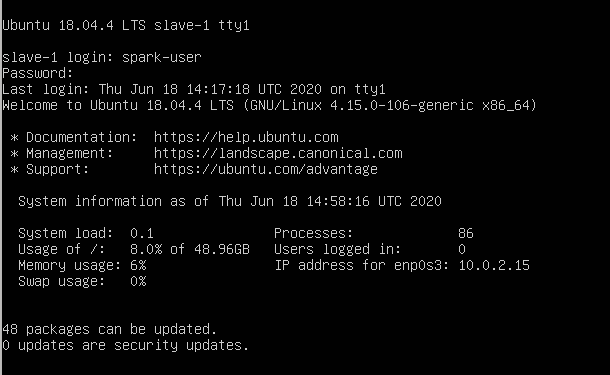

- After login enter the command below:
```bash
sudo hostnamectl set-hostname slave-2 # Change hostname to slave-2
exit # Logout to check the new host-name
```

- If you see a screen like this, then everything is fine:

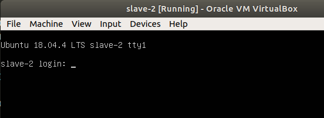

## 1.5. Update & Configure Both Slave Machines
We have 2 Virtual Ubuntu 18 machines. Note that, you can do the cloning operation later. But when you do it later, you should remember to change all variables specific to the machine, such as IP. Now we wil configure IP addresses.

- Log into both machines and enter the command:
```bash
sudo apt update && sudo apt upgrade
```
- Log into one machine (let's say "slave-1") and run the command
```ifconfig```. You will see that IP address like 10.0.X.Y shown below:

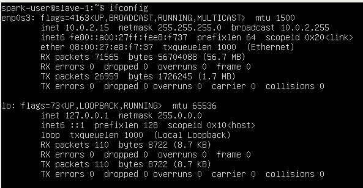

However, we need a private network for 3 machines and IP addresses must follow the pattern of "192.168.X.Y". 

- First, we will create our private network interface. We should have "192.168.X.Y" IP adresses in slave machines for communication of devices. Go to ```File > Host Network Manager``` in VirtualBox and hit _Create_. Now you should see "vboxnet".

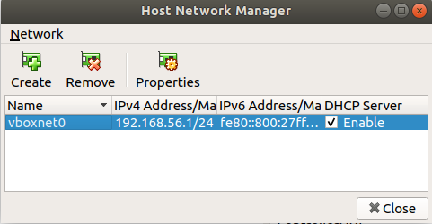 

Be sure that "DHCP Server" option is **enabled**.

- Now, go to _Settings_ of both machines and go to "Network" option. You should select "Attached to" as _Host-only Adapter_ and choose "Name" as _vboxnet0_.  

## In VirtualBox
Use bridged network and check the ip for being started with "192.168". 