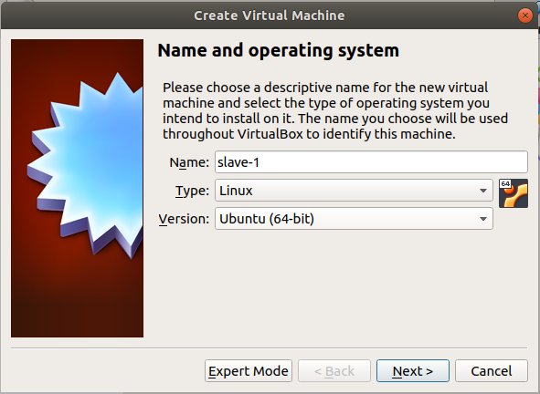
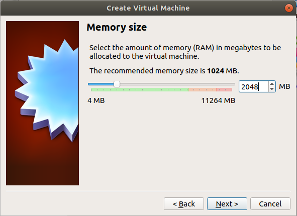
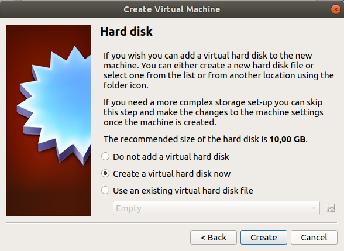
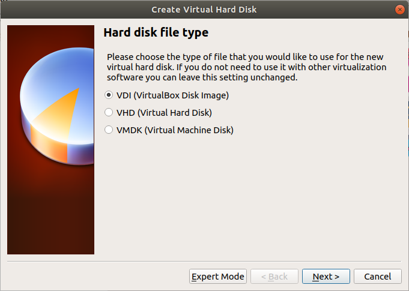

# Virtual Machine Installation & Configuration Guide

## 1. Install and Configure Virtual Machines using Virtualbox

In this tutorial it is accepted that:
- You have already installed Ubuntu 18.04.4 LTS in your *local* computer.
- You have updated and upgraded all packages.
- You have a valid internet connection.

### 1.1. Install VirtualBox from Command Line:
```bash
sudo apt install virtualbox
```
### 1.2. Get 18.04.4 LTS Server Install Image:
You can download iso file from the link: [Official Ubuntu 18.04.4 LTS Live Server ISO](http://releases.ubuntu.com/bionic/ubuntu-18.04.4-live-server-amd64.iso)

***OR***

You can download iso file from command line:
```bash
cd ~/Downloads
wget http://releases.ubuntu.com/bionic/ubuntu-18.04.4-live-server-amd64.iso
```

## 1.3. Create & Configure Virtual Machines
- Firstly, start VirtualBox using command below:
```bash 
virtualbox &
```
- Click "New" button.
- Enter _Name_ as "slave-1", _Type_ as "Linux", _Version_ as "Ubuntu (64-bit)".


- Select the amount of memory (RAM). We select _2048 MB_ (2 GB), arbitrarily.  You can change it up to your needs.





- 
- 
- 
- 


## In VirtualBox
Use bridged network and check the ip for being started with "192.168"