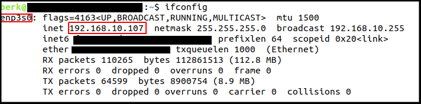
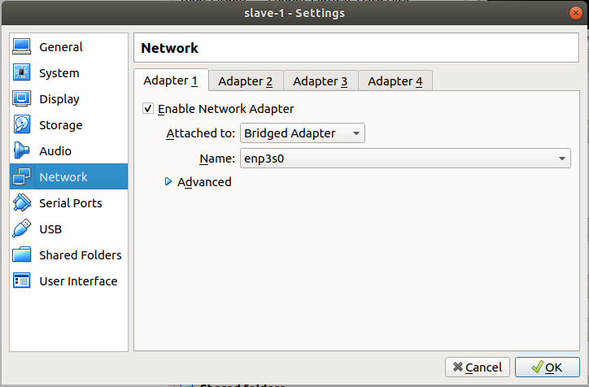
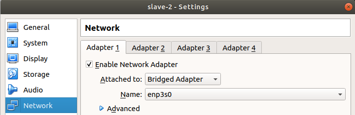
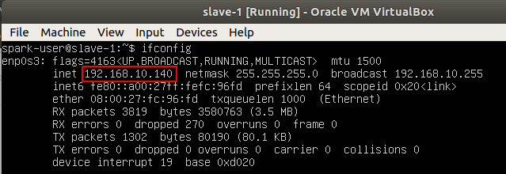
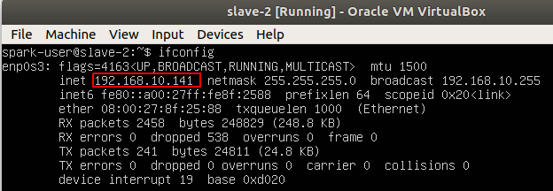
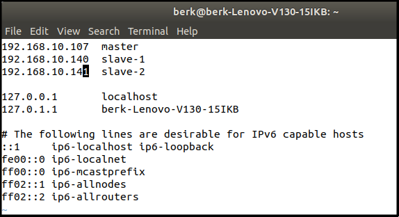
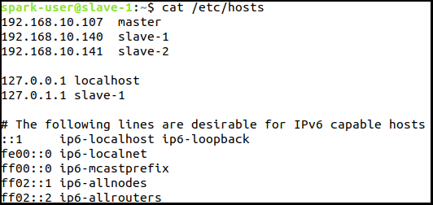

# Virtual Machine Installation & Configuration Guide

We will install and configure virtual machines using VirtualBox. In this tutorial it is accepted that:
- You have already installed Ubuntu 18.04.4 LTS in your *local* computer.
- You have updated and upgraded all packages.
- You have a valid internet connection.

## 1.1. Download Image File and VirtualBox

- Install VirtualBox from Command Line:
```bash
sudo apt install virtualbox
```
- Get 18.04.4 LTS Server Install Image:
You can download iso file from the link: [Official Ubuntu 18.04.4 LTS Live Server ISO](http://releases.ubuntu.com/bionic/ubuntu-18.04.4-live-server-amd64.iso)

***OR***

You can download iso file from command line:
```bash
cd ~/Downloads
wget http://releases.ubuntu.com/bionic/ubuntu-18.04.4-live-server-amd64.iso
```

## 1.2. Create First Slave Machine
- Firstly, start VirtualBox using command below:
```bash 
virtualbox &
```
- Click "New" button.
- Enter _Name_ as "slave-1", _Type_ as "Linux", _Version_ as "Ubuntu (64-bit)".


- Select the amount of memory (RAM). We select _2048 MB_ (2 GB), arbitrarily.  You can change it up to your needs.


- Create a _virtual hard disk_ for convenience.


- Choose _VDI (VirtualBox Disk Image)_.


- _Dynamically allocated_ has its own advantages, so we will choose it. But _fixed-size_ option would also be selected if we were sure that disk size don't need to change in the future.


- We will enter the name of the new virtual hard disk file as "slave-1". This name is arbitrary, you can change it. Size of the virtual hard disk is **very important**. You should set it at least **20 GB**, we will set it as _50 GB_ to be safe.


- Choose the Ubuntu ISO, you downloaded before.


- Pass the initial parts and select the options. When you are in  _Profile setup_ part. We will set "Your Name" as _spark-user_, "Your server's name" as _slave-1_, "Pick a username" as _spark-user_. Names can change but user-names should be the same among all machines to be safe in future ssh connections.


- Select "Install OpenSSH Server".


- No need to install any packages listed here. We can install them after the installation if needed.


- Reboot after installation and you are done!

## 1.3. Create Second Slave Machine

You don't have to do all the things again. Simply, clone the first virtual machine.

- Shut machine "slave-1" down.
- Click right click on "slave-1" and select "clone" option. Rename the machine to "slave-2".


- Choose _full clone_ option and hit _Clone_.


- Our second virtual machine is ready, but the hostname of the machine is still "slave-1". In order to fix this, start slave-2 and login with credentials you defined in the installation of slave-1.


- After login enter the command below:
```bash
sudo hostnamectl set-hostname slave-2 # Change hostname to slave-2
exit # Logout to check the new host-name
```

- If you see a screen like this, then everything is fine:


We have 2 Virtual Ubuntu 18 machines now. Note that, you could have done the cloning operation later. But when you do it later, you should remember to change all variables specific to the machine, such as IP. 

## 1.4. Network & SSH Configuration of Both Slave Machines
We can configure IP addresses and SSH to make the system easy to use and maintain.

- First of all, updating systems could be useful. Log into both machines and enter the command:
```bash
sudo apt update && sudo apt upgrade
```
- Log into one machine (let's say "slave-1") and run the command ```ifconfig```. You will see that IP address like 10.0.X.Y shown below:


This is a default IP address for virtual machine. All machines can connect to the internet with this IP address, but cannot connect to each other directly. So, we need a private network for 3 machines and IP addresses must follow the pattern of "192.168.X.Y". 

- If your local machine is connected to the internet (otherwise you couldn't update the virtual machines), your local machine must have already a private network IP address which starts with "192.168". We need to determine which **network interface** is responsible for this network in local. So, run the command ```ifconfig``` in your _local machine_. The output would be like this:

 

The network interface we should remember is _enp3s0_ in this scenario.

- Go to VirtualBox, right click on both virtual machines, go to _Settings_ and go to _Network_ tab. You should see "NAT" adapter attached. Change this to "Bridged Adapter" and change name to "enp3s0" (i.e. the network interface we found). You don't need any other adapter. Apply this for _both machines_, as shown below:

 
 

- Login to both machines and run the command ```ifconfig```. You will see that each machine has its own IP starts with "192.168", as shown below:

 


We already know that our local machine's IP is ```192.168.10.107 ```. So we can make a table like this:


| Host-Name | IP Address     | Info                      |
|-----------|----------------|---------------------------|
| master    | 192.168.10.107 | Local Ubuntu 18 Machine   |
| slave-1   | 192.168.10.136 | Virtual Ubuntu 18 Machine |
| slave-2   | 192.168.10.134 | Virtual Ubuntu 18 Machine |

- In _master machine_ (local machine), we will add these hostnames in order to be safe in the future. Open ```/etc/hosts``` file with your favorite text editor (gedit,GNU Emacs, Nano, vim, etc.) and add the following lines to the top of the document:
```bash
192.168.10.107	master
192.168.10.136	slave-1	
192.168.10.134	slave-2
```
and file look will look like:



- In order to be sure that everything is fine so far, ping all machines in local machine:

```bash
ping master
ping slave-1	
ping slave-2
```

- You should see that ICMP packages find slaves and master machines:



## 1.5. SSH Configuration
- First let's create a linux user dedicated to spark & hdfs operations. We created "spark-user" users in slave machines before, so we can add a user with same name in _master machine._ In master machine run the following commands:
```bash
sudo adduser spark-user # Add a user with name "spark-user".
```
Enter & retype a password and press enter for following questions. 

- Run the following command to add a group with the same name:
```bash
sudo usermod -aG spark-user spark-user # Add a group with name "spark-user".
```

- Add "spark-user" to sudoers in order to allow spark-user to be root:
```bash
sudo adduser spark-user sudo
```
- Login as "spark-user":
```bash
su spark-user
```

- Make sure that openssh-server is installed correctly. If you are not sure and just to be safe, run the following commands:
```bash
sudo apt-get purge openssh-server # Removes openssh-server completely
sudo apt-get install openssh-server # Installs openssh-server
ssh localhost
```
You should successfully connect to localhost via ssh.

- As "spark-user", create ssh-key with following command:
```bash
su spark-user
ssh-keygen
```
You can press enter the all questions showed up in ssh-key generation.

- Your public key should be in ```/home/spark-user/.ssh/id_rsa.pub```. To check this, run the following command:
```bash
cat /home/spark-user/.ssh/id_rsa.pub
```
If you see a long string starts with "ssh-rsa ", then everything's ok.

- Now we will copy this id to all machines for paswordless login. Run the following commands:
```bash
ssh-copy-id spark-user@slave-1
ssh-copy-id spark-user@slave-2
ssh-copy-id spark-user@master
```
- Now, ssh to machines seperately, to check that ssh configuration is set correctly.
```bash
ssh slave-1
exit # Exit from machine slave-1
```
```bash
ssh slave-2
exit # Exit from machine slave-2
```
```bash
ssh master
exit # Exit from master
```
You should see no password authentication and it should connect directly.


## To next section
```bash
chown spark-user:root -R /usr/local/spark-user
chmod g+rwx -R /usr/local/spark-user
```


## References
* https://www.linuxbabe.com/linux-server/setup-passwordless-ssh-login
* https://dzone.com/articles/install-a-hadoop-cluster-on-ubuntu-18041
