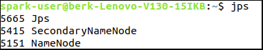
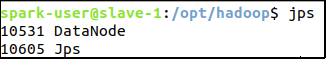
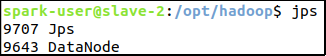
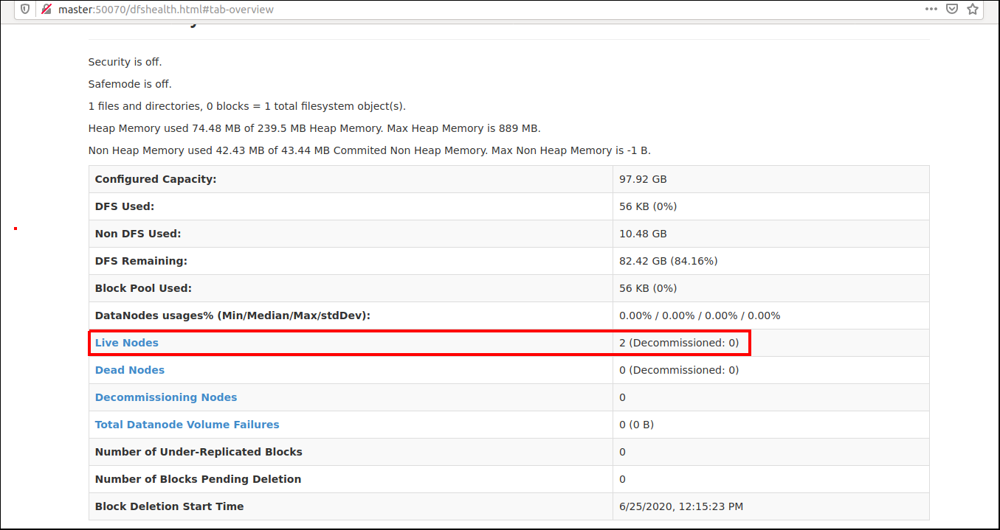

# HDFS & Yarn & Spark Installation Guide

We will install and configure virtual machines using VirtualBox. In this tutorial it is accepted that:
- You have 3 machines (1 master, 2 slaves).
- You have installed Ubuntu 18.04.4 LTS in your *local* (master) machine and in slaves.
- You have updated and upgraded all packages in all machines.
- You have a valid internet connection for master and slaves.
- There is a user with the same name for all machines, such as ```spark-user```.
- You have passwordless SSH access to slaves from master.
- Hosts (```/etc/hosts```) file is configured for all machines, like shown below:

| Host-Name | IP Address     | Info                      |
|-----------|----------------|---------------------------|
| master    | 192.168.10.107 | Local Ubuntu 18 Machine   |
| slave-1   | 192.168.10.140 | Virtual Ubuntu 18 Machine |
| slave-2   | 192.168.10.141 | Virtual Ubuntu 18 Machine |

**Note:** If one of this criteria is absent, please check the first guide ***Virtual Machine Installation & Configuration Guide***, via the [link](../1-%20Virtual%20Machine%20Installation%20%26%20Configuration/guide.md).

## 1.1. Install Java 8
> This section is for **all** (1 master, 2 slaves) machines. Perform all steps in all machines.

**Note \#1:** This approach is valid when using version 8 (1.8) of Java. For Java-11 or other versions, you should perform the similar but not the same steps.

**Note \#2:** OpenJDK, which is a free and open-source implementation of the Java Platform - Standard Edition, is used here.

- Install Java Runtime Environment (JRE) and Java Development Kit (JRE) in *all machines*:
```bash
sudo apt install openjdk-8-jre
sudo apt install openjdk-8-jdk
java -version
```

- Your JVM (Java Virtual Machine) directory should be located under ```/usr/lib/jvm``` directory. We will create a symbolic link to your jvm for abstraction:
```bash
cd /usr/lib/jvm
sudo ln -sf java-8-openjdk* current-java
```
And we can access to our jvm using path ```/usr/lib/jvm/current-java```.

- Now we will add ***java-home path***, i.e. ```$JAVA_HOME```:
```bash
su spark-user # You must be spark-user, if you are already, ignore this command
echo 'export JAVA_HOME=/usr/lib/jvm/current-java' >> ~/.bashrc
```
**Attention:** If java will also be used by another users, you can do the same for these users.

- Confirm ```$JAVA_HOME``` variable is set correctly,  _in all machines_:
```bash
source ~/.bashrc # Reload the changed bashrc file
echo $JAVA_HOME
```
You should see ```/usr/lib/jvm/current-java``` in command-line.

## 1.2. Download & Install Hadoop 2.7
- Go to http://apache.claz.org/hadoop/common and find the current 2.7 release. At the time this document was written (June 23, 2020), Hadoop's version 2.7 was in the 7th sub-version.


- We will download Hadoop in *Master* first and then transfer Hadoop files to slaves. In ***master machine***, download, untar & move Hadoop files using command-line and copy hadoop files to remote slaves:
```bash
cd ~ # Go to home directory
wget http://apache.claz.org/hadoop/common/hadoop-2.7.7/hadoop-2.7.7.tar.gz
tar -xvf hadoop-2.7.7.tar.gz # Untar Hadoop files
scp -r ./hadoop-2.7.7 spark-user@slave-1:~/ # Copy files to slave-1
scp -r ./hadoop-2.7.7 spark-user@slave-2:~/ # Copy files to slave-2
rm hadoop-2.7.7.tar.gz # Delete redundant archive file
```

- In **all machines**, we will move the hadoop files under ```/opt``` directory for maintainability and handle permissions: 
```bash
# For master Machine
sudo mv hadoop-2.7.7 /opt/ # Move Hadoop files to /opt/ directory
sudo ln -sf /opt/hadoop-2.7.7 /opt/hadoop # Create symbolic link for abstraction
sudo chown spark-user:root /opt/hadoop* -R # Change user:spark-user, group:root
sudo chmod g+rwx /opt/hadoop* -R # Allow group to read-write-execute

# For slave-1 Machine
ssh slave-1
sudo mv hadoop-2.7.7 /opt/ # Move Hadoop files to /opt/ directory
sudo ln -sf /opt/hadoop-2.7.7 /opt/hadoop # Create symbolic link for abstraction
sudo chown spark-user:root /opt/hadoop* -R # Change user:spark-user, group:root
sudo chmod g+rwx /opt/hadoop* -R # Allow group to read-write-execute
exit # Logout from slave-1

# For slave-2 Machine
ssh slave-2
sudo mv hadoop-2.7.7 /opt/ # Move Hadoop files to /opt/ directory
sudo ln -sf /opt/hadoop-2.7.7 /opt/hadoop # Create symbolic link for abstraction
sudo chown spark-user:root /opt/hadoop* -R # Change user:spark-user, group:root
sudo chmod g+rwx /opt/hadoop* -R # Allow group to read-write-execute
exit # Logout from slave-2
```

- In **all machines**, append hadoop paths to ```$PATH``` variable and set ```$HADOOP_HOME``` variable:
```bash
echo 'export PATH=$PATH:/opt/hadoop/bin:/opt/hadoop/sbin' >> ~/.bashrc
echo 'export HADOOP_HOME=/opt/hadoop' >> ~/.bashrc
source ~/.bashrc
echo $PATH # Confirm that $PATH variable is changed properly
echo $HADOOP_HOME # Confirm that $HADOOP_HOME variable is set properly
```
Outputs should be:
```bash
# For $PATH:
<OTHER_PATHS>:/opt/hadoop/bin:/opt/hadoop/sbin
# For $HADOOP_HOME:
/opt/hadoop
```

## 1.3. Configure Hadoop
> We will first configure *master* machine and then transfer configuration file to remote slaves.

- In *master machine*, we will edit ```$HADOOP_HOME/etc/hadoop/core-site.xml```.  Your "configuration" tag in this file should look like this:
```xml
<configuration>
	<property>
		<name>fs.default.name</name>
		<value>hdfs://master:9000</value>
	</property>
</configuration>
```

- In *master machine*, we will edit ```$HADOOP_HOME/etc/hadoop/hdfs-site.xml```.  Your "configuration" tag in this file should look like this:
```xml
<configuration>
	<property>
		<name>dfs.namenode.name.dir</name>
		<value>/opt/hadoop/data/namenode</value>
	</property>
	<property>
		<name>dfs.datanode.data.dir</name>
		<value>/opt/hadoop/data/datanode</value>
	</property>
	<property>
		<name>dfs.replication</name>
		<value>2</value>
	</property>
</configuration>

```

- In *master machine*, we will edit ```$HADOOP_HOME/etc/hadoop/hadoop-env.sh```. Find the line contains ```export JAVA_HOME``` and change this line like:
```bash
export JAVA_HOME=/usr/lib/jvm/current-java
```
After editing, the relevant lines of the file should look line:


- In **master machine**, we will edit ```$HADOOP_HOME/etc/hadoop/slaves```. If ```localhost``` line is present in the file, delete it. Add the following lines only:
```
slave-1
slave-2
```
**Note that:** The file ```slaves``` renamed to ```workers``` in further Hadoop versions. So if you follow this tutorial for further versions of Hadoop and sure that a file named ```workers``` exists under directory ```$HADOOP_HOME/etc/hadoop/```, then edit ```workers```.

- Transfer configuration files directly to slave machines:
```bash
scp  $HADOOP_HOME/etc/hadoop/* slave-1:$HADOOP_HOME/etc/hadoop/ # For slave-1
scp  $HADOOP_HOME/etc/hadoop/* slave-2:$HADOOP_HOME/etc/hadoop/ # For slave-2
```

- In **master machine**, format the HDFS file system:
```bash
hdfs namenode -format
```

- In **master machine**, start HDFS:
```bash
start-dfs.sh # or $HADOOP_HOME/sbin/start-dfs.sh
```

- Validate that everything started right by running the ```jps``` command as spark-user on all machines.

On master node, you should see ```SecondaryNameNode``` and ```NameNode``` like shown below:



On slave nodes (slave-1, slave-2), you should see ```DataNode``` like shown below:





- If everything is allright, you can now access the HDFS web UI by browsing to your Hadoop Master Server port ```50070```. Go to [http://master:50070/](http://master:50070/):


If you see a web page like shown above, then everything is OK for now.

**Note that:** In other versions of Hadoop, port number may change. For example, port number ```9870``` is for Hadoop 3.1.1.

- In **master machine**, if you want to stop HDFS run the following command:
```bash
stop-dfs.sh # or $HADOOP_HOME/sbin/stop-dfs.sh
```

## References
* https://dzone.com/articles/install-a-hadoop-cluster-on-ubuntu-18041
