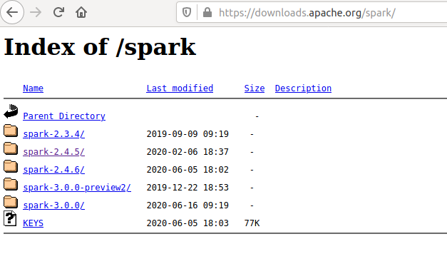
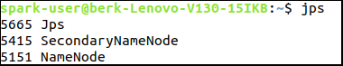
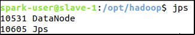
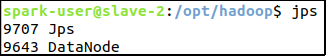
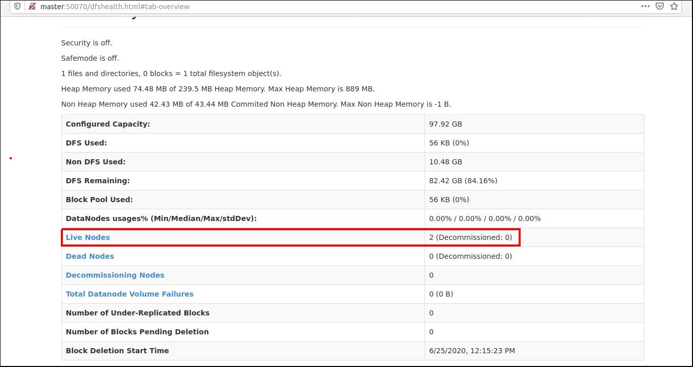

# 3 - Spark Installation Guide

We will install and configure Spark 2.4. In this tutorial it is accepted that:
- You have 3 machines (1 master, 2 slaves).
- You have installed Ubuntu 18.04.4 LTS in your *local* (master) machine and in slaves.
- You have updated and upgraded all packages in all machines.
- You have a valid internet connection for master and slaves.
- There is a user with the same name for all machines, such as ```spark-user```.
- You have passwordless SSH access to slaves from master.
- Hosts (```/etc/hosts```) file is configured for all machines, like shown below:

| Host-Name | IP Address     | Info                      |
|-----------|----------------|---------------------------|
| master    | 192.168.10.107 | Local Ubuntu 18 Machine   |
| slave-1   | 192.168.10.140 | Virtual Ubuntu 18 Machine |
| slave-2   | 192.168.10.141 | Virtual Ubuntu 18 Machine |

- Java 8 is installed.
- Hadoop, HDFS and Yarn is configured and installed.
- Slaves and master machines can connect to each other via SSH _passwordless_.

**Note:** If one of this criteria is absent, please check the first guide [Virtual Machine Installation & Configuration Guide](../1%20-%20Virtual%20Machine%20Installation%20%26%20Configuration/guide.md) and second guide [HDFS & Yarn Installation Guide](../2%20-%20HDFS%20&%20Yarn%20Installation/guide.md).

## 3.1. Install Scala
> This section is for **all** (1 master, 2 slaves) machines. Perform all steps in all machines.

- Install Scala in *all machines*:
```bash
sudo apt install scala
```

- Confirm that Scala is installed correctly, _in all machines_:
```bash
scala -version
```
Output should look like _in all machines_:
```bash
Scala code runner version 2.11.12 -- Copyright 2002-2017, LAMP/EPFL
```

## 3.2. Download & Install Spark 2.4
- Go to https://downloads.apache.org/spark and find the current 2.4 release. At the time this document was written (June 25, 2020), Hadoop's version 2.4 was in the 5th sub-version and 6th sub-version. We will choose _version 2.4.5_ in this tutorial.


- We will download Spark in *Master* first and then transfer Spark files to slaves. In ***master machine***, download, untar & move Spark files using command-line and copy Spark files to remote slaves:
```bash
cd ~ # Go to home directory
wget https://downloads.apache.org/spark/spark-2.4.5/spark-2.4.5.tgz
tar -xvf spark-2.4.5.tgz  # Untar Spark files
rm ./spark-2.4.5.tgz # Delete redundant archive file
scp -r ./spark-2.4.5 spark-user@slave-1:~/ # Copy files to slave-1
scp -r ./spark-2.4.5 spark-user@slave-2:~/ # Copy files to slave-2
```

- In **all machines**, we will move the hadoop files under ```/opt``` directory for maintainability and handle permissions: 
```bash
# For master Machine
sudo mv spark-2.4.5 /opt/ # Move Spark files to /opt/ directory
sudo ln -sf /opt/spark-2.4.5 /opt/spark # Create symbolic link for abstraction
sudo chown spark-user:root /opt/spark* -R # Change user:spark-user, group:root
sudo chmod g+rwx /opt/spark* -R # Allow group to read-write-execute

# For slave-1 Machine
ssh slave-1
sudo mv spark-2.4.5 /opt/ # Move Spark files to /opt/ directory
sudo ln -sf /opt/spark-2.4.5 /opt/spark # Create symbolic link for abstraction
sudo chown spark-user:root /opt/spark* -R # Change user:spark-user, group:root
sudo chmod g+rwx /opt/spark* -R # Allow group to read-write-execute
exit # Logout from slave-1

# For slave-2 Machine
ssh slave-2
sudo mv spark-2.4.5 /opt/ # Move Spark files to /opt/ directory
sudo ln -sf /opt/spark-2.4.5 /opt/spark # Create symbolic link for abstraction
sudo chown spark-user:root /opt/spark* -R # Change user:spark-user, group:root
sudo chmod g+rwx /opt/spark* -R # Allow group to read-write-execute
exit # Logout from slave-2
```

- In **all machines**, append Spark paths to ```$PATH``` variable and export ```$SPARK_HOME```:
```bash
echo '
# For Spark
export PATH=$PATH:/opt/spark/bin
export SPARK_HOME=/opt/spark
' >> ~/.bashrc
source ~/.bashrc # Reload the changed bashrc file
echo $PATH $SPARK_HOME # Confirm that $PATH and $SPARK_HOME variable is changed properly
```
Output should be: ```<OTHER_PATHS>:/opt/hadoop/bin:/opt/spark/bin /opt/spark```.

## 3.3. Configure Spark
> We will first configure *master* machine only.

- In *master machine*, we will edit ```$SPARK_HOME/conf/spark-env.sh```. But before, change ```spark-env.sh.template``` to ```spark-env.sh```:
```bash
mv $SPARK_HOME/conf/spark-env.sh.template $SPARK_HOME/conf/spark-env.sh
```

- Open up ```$SPARK_HOME/conf/spark-env.sh``` with a text editor (e.g., GNU Emacs, Vim, Gedit, Nano) and set the following parameters by appending the following lines:
```bash
export SPARK_MASTER_HOST=master
export JAVA_HOME=/usr/lib/jvm/current-java
```

- In *master machine*, we will edit ```$SPARK_HOME/conf/slaves```. But before, change ```slaves.template``` to ```slaves```:
```bash
mv $SPARK_HOME/conf/slaves.template $SPARK_HOME/conf/slaves
```

- Open up ```$SPARK_HOME/conf/slaves``` with a text editor.  If ```localhost``` line is present in the file, delete it. Add the following lines only:
```
slave-1
slave-2
```

Your ```$SPARK_HOME/conf/slaves``` file should look like:

- In **master machine**, format the HDFS file system:
```bash
hdfs namenode -format
```

- In **master machine**, start HDFS:
```bash
start-dfs.sh # or $HADOOP_HOME/sbin/start-dfs.sh
```

- Validate that everything started right by running the ```jps``` command as spark-user on all machines.

On master node, you should see ```SecondaryNameNode``` and ```NameNode``` like shown below:



On slave nodes (slave-1, slave-2), you should see ```DataNode``` like shown below:





- If everything is OK, you can now access the HDFS web UI by browsing to your Hadoop Master Server port ```50070```. Go to [http://master:50070/](http://master:50070/):



If you see a web page like shown above and _**Live Nodes**_ attribute is _2_, then everything is OK. This indicates that you have 1 name-node (the one which this web-site runs on) and 2 live data-nodes (as _live nodes_).

**Note that:** In other versions of Hadoop, port number may change. For example, port number ```9870``` is used for Hadoop 3.1.1.

- In **master machine**, if you want to stop HDFS run the following command:
```bash
stop-dfs.sh # or $HADOOP_HOME/sbin/stop-dfs.sh
```

## 3.4. Configure Yarn
> HDFS is installed and configured but it's lack of job scheduling. So we could overcome the problem with Yarn Job Scheduler.

- In **all machines**, export ```$HADOOP_YARN_HOME``` variable:
```bash
echo '# Bash Variables for Yarn
export HADOOP_YARN_HOME=$HADOOP_HOME' >> ~/.bashrc

source ~/.bashrc # Reload the changed bashrc file
echo $HADOOP_YARN_HOME
```
Output should be: ```/opt/hadoop```

- In *master machine*, we will edit ```$HADOOP_HOME/etc/hadoop/yarn-site.xml```.  Your "configuration" tag in this file should look like this:
```xml
<configuration>
	<property>
		<name>yarn.resourcemanager.hostname</name>
		<value>master</value>
	</property>
</configuration>
```

- In *master machine*, transfer ```yarn-site.xml``` file to slave machines:
```bash
scp $HADOOP_HOME/etc/hadoop/yarn-site.xml slave-1:$HADOOP_HOME/etc/hadoop/yarn-site.xml # Copy yarn config to slave-1
scp $HADOOP_HOME/etc/hadoop/yarn-site.xml slave-2:$HADOOP_HOME/etc/hadoop/yarn-site.xml # Copy yarn config to slave-2
```

- In **master machine**, start Yarn:
```bash
start-yarn.sh # or $HADOOP_HOME/sbin/start-yarn.sh
```

- Validate that everything started right by running the ```jps``` command as spark-user on all machines.

On master node, you should see ```ResourceManager``` like shown below:


On slave nodes (slave-1, slave-2), you should see ```NodeManager``` like shown below:


- Make sure that yarn is running on 2 slave machines:
```bash 
yarn node --list
``` 
You should see that _2 nodes_ are running like shown below:


- In **master machine**, if you want to stop Yarn run the following command:
```bash
stop-yarn.sh # or $HADOOP_HOME/sbin/stop-yarn.sh
```
## 3.5. Test Hadoop & Yarn

- In **master machine**, start HDFS & yarn:
```bash
su spark-user # Login as spark-user, if you are already, ignore this
start-dfs.sh && start-yarn.sh
```

- Validate that everything is OK so far with [Hadoop Web UI](http://master:8088/cluster).
Web-page should look like:


If you see a web page like shown above and _**Active Nodes**_ attribute is _2_, then everything is OK.

- Run Hadoop job example _Calculate PI_:
```bash
yarn jar $HADOOP_HOME/share/hadoop/mapreduce/hadoop-mapreduce-examples*.jar pi 16 1000
```
Output should be like shown below:


## References
* https://medium.com/ymedialabs-innovation/apache-spark-on-a-multi-node-cluster-b75967c8cb2b
